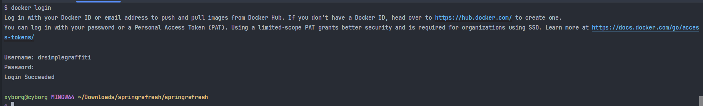
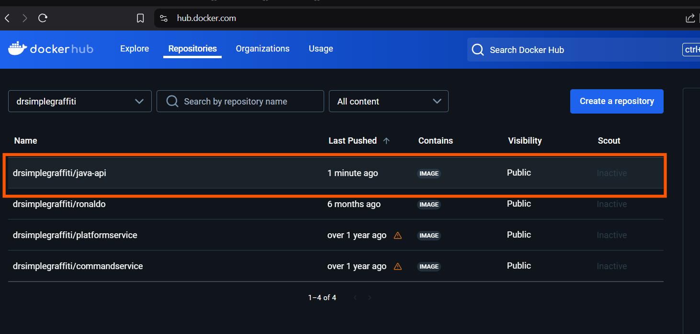
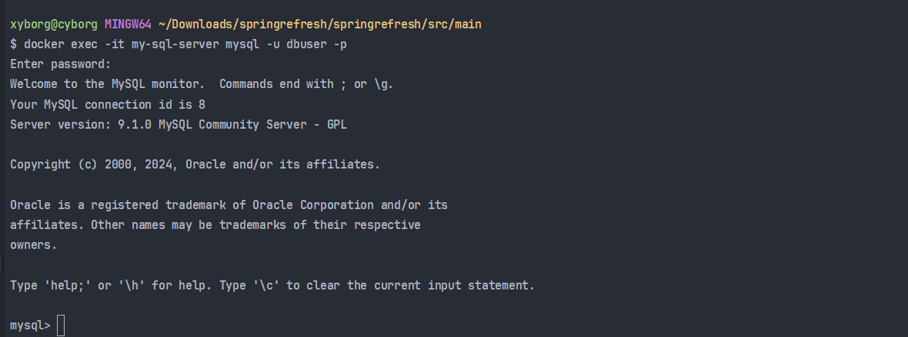

Change the final name of your executable jar by add adding the final name to your pm.xml
```xml
<?xml version="1.0" encoding="UTF-8"?>
<project xmlns="http://maven.apache.org/POM/4.0.0" xmlns:xsi="http://www.w3.org/2001/XMLSchema-instance"
	xsi:schemaLocation="http://maven.apache.org/POM/4.0.0 https://maven.apache.org/xsd/maven-4.0.0.xsd">
	<modelVersion>4.0.0</modelVersion>
	<parent>
		<groupId>org.springframework.boot</groupId>
		<artifactId>spring-boot-starter-parent</artifactId>
		<version>3.0.0</version>
		<relativePath/> <!-- lookup parent from repository -->
	</parent>
	<groupId>com.abcode</groupId>
	<artifactId>springrefresh</artifactId>
	<version>0.0.1-SNAPSHOT</version>
	<name>springrefresh</name>
	<description>Demo project for Spring Boot</description>
	<url/>
	<licenses>
		<license/>
	</licenses>
	<developers>
		<developer/>
	</developers>
	<scm>
		<connection/>
		<developerConnection/>
		<tag/>
		<url/>
	</scm>
	<properties>
		<java.version>17</java.version>
	</properties>
	<dependencies>
		<dependency>
			<groupId>org.springframework.boot</groupId>
			<artifactId>spring-boot-starter-data-jpa</artifactId>
		</dependency>
		<dependency>
			<groupId>org.springframework.boot</groupId>
			<artifactId>spring-boot-starter-web</artifactId>
		</dependency>

		<dependency>
			<groupId>com.mysql</groupId>
			<artifactId>mysql-connector-j</artifactId>
			<scope>runtime</scope>
		</dependency>
		<dependency>
			<groupId>org.projectlombok</groupId>
			<artifactId>lombok</artifactId>
			<optional>true</optional>
		</dependency>
		<dependency>
			<groupId>org.springframework.boot</groupId>
			<artifactId>spring-boot-starter-test</artifactId>
			<scope>test</scope>
		</dependency>
	</dependencies>

	<build>
		<finalName>rocky-v1</finalName>
		<plugins>
			<plugin>
				<groupId>org.apache.maven.plugins</groupId>
				<artifactId>maven-compiler-plugin</artifactId>
				<configuration>
					<annotationProcessorPaths>
						<path>
							<groupId>org.projectlombok</groupId>
							<artifactId>lombok</artifactId>
							<version>1.18.24</version>
						</path>
					</annotationProcessorPaths>
				</configuration>
			</plugin>
			<plugin>
				<groupId>org.springframework.boot</groupId>
				<artifactId>spring-boot-maven-plugin</artifactId>
				<configuration>
					<excludes>
						<exclude>
							<groupId>org.projectlombok</groupId>
							<artifactId>lombok</artifactId>
						</exclude>
					</excludes>
				</configuration>
			</plugin>
		</plugins>
	</build>

</project>

```

Then run maven clean install

### Docker
Create a docker file in the root folder
```DockerFile
FROM openjdk:17-jdk-alpine

# Copy the JAR file into the container
COPY target/rocky-v1.jar app-v2.jar

# Expose port 8080
EXPOSE 8080

# Define the entry point to run your application
ENTRYPOINT ["java", "-jar", "app-v2.jar"]

```

### Build the docker image
Ensure you are signed in to your docker hub account

```bash
docker build -t dev-app-image .
```

### push to docker hub
```bash
docker tag dev-app-image:latest drsimplegraffiti/java-api:1.0
docker push drsimplegraffiti/java-api:1.0
```


### mysql docker
create a docker file
```dockerfile
# Use the official MySQL Docker image
FROM mysql:latest

# Set the MySQL root password (replace with your desired password)
ENV MYSQL_ROOT_PASSWORD=Bassguitar1

# Set a non-root user and password (replace with your desired username and password)
ENV MYSQL_USER=dbuser
ENV MYSQL_PASSWORD=rootpass

# (Optional) Create a new database (replace with your desired database name)
ENV MYSQL_DATABASE=dream_shops_db

# Expose the MySQL port
EXPOSE 3307
```

Build it. Ensure  you cd to where you have the mysql docker
```bash
docker build -t my-sql-image .
```

Push to docker hub
```bash
docker tag my-sql-image:latest drsimplegraffiti/java-api:mysql
docker push drsimplegraffiti/java-api:mysql
```

Run the container
```bash
docker run --name my-sql-server -p 3307:3307 -d my-sql-image
```

Login to mysql
```bash
docker exec -it my-sql-server mysql -u dbuser -p
```


### Create database
```mysql
CREATE DATABASE dream_shops_db;
SHOW DATABASES;
USE dream_shops_db;
```

### create table
```mysql
CREATE TABLE IF NOT EXISTS player
(id INT NOT NULL PRIMARY KEY auto_increment,
name VARCHAR(32) not null
);
```

### modify `application.properties`
```properties
spring.datasource.url=${DATABASE_URL}
spring.datasource.username=${DATABASE_USERNAME}
spring.datasource.password=${DATABASE_PASSWORD}
spring.jpa.hibernate.ddl-auto=update
spring.jpa.properties.hibernate.dialect=org.hibernate.dialect.MySQLDialect
```

### Use docker compose to start and connect app to msql database
```docker-compose
version: '3'
services:
  my-sql-server:
    container_name: my-sql-server
    image: drsimplegraffiti/java-api:mysql
    ports:
      - "3307:3307"

  java-crud-app:
    container_name: java_api
    image: java-api:latest
    ports:
      - "8080:8080"
    environment:
      - DATABASE_URL=jdbc:mysql://my-sql-server:3307/dream_shops_db
      - DATABASE_USERNAME=dbuser
      - DATABASE_PASSWORD=rootpass
    depends_on:
      - my-sql-server

 ```

### start docker compose
```bash
docker-compose -f docker_compose.yml up
```

### Interceptor
Allow intercepting Http request and response before getting controller
fo: logging, caching, security

### install protobuf
https://stackoverflow.com/questions/13616033/install-protocol-buffers-on-windows
Go to: https://github.com/protocolbuffers/protobuf/releases
Extract and copy the bin folder to the system path variable

Or just use
```bash
choco install protoc
```

Create your greet.proto in the main folder
main/proto/greet.proto
```
syntax = "proto3";

option java_multiple_files = true;
option java_package = "com.example.grpc";
option java_outer_classname = "GreetProto";

package greet;

// The greeting service definition.
service GreetService {
  // Sends a greeting
  rpc Greet (GreetRequest) returns (GreetResponse);
}

// The request message containing the user's name.
message GreetRequest {
  string name = 1;
}

// The response message containing the greetings.
message GreetResponse {
  string greeting = 1;
}

```

Compile your proto file
```bash
protoc --java_out=src/main/java --proto_path=src/main/proto src/main/proto/bank.proto
```